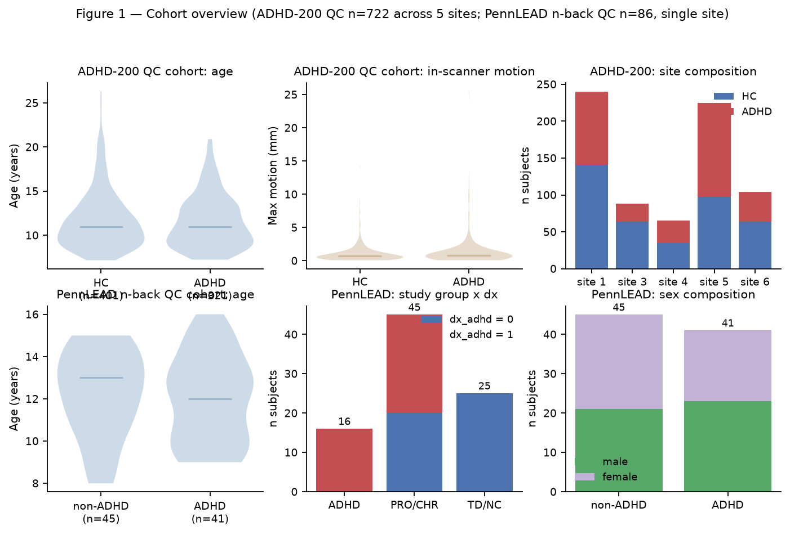
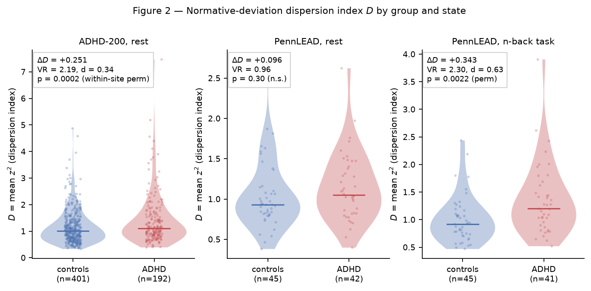
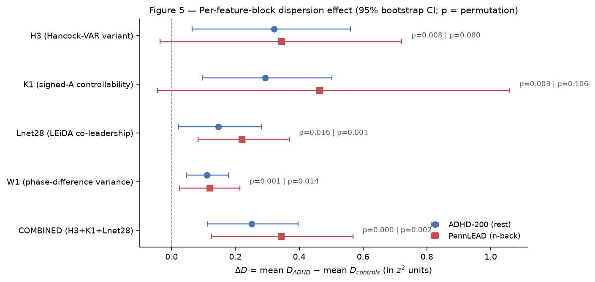
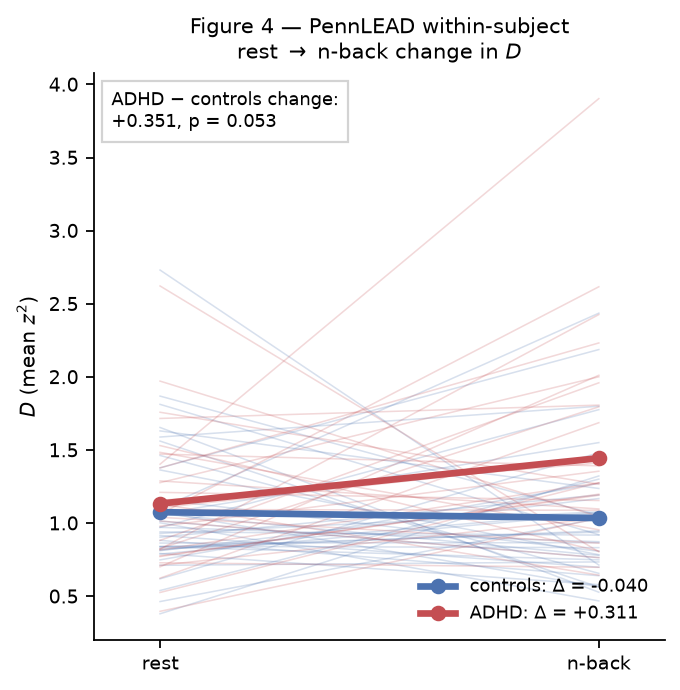
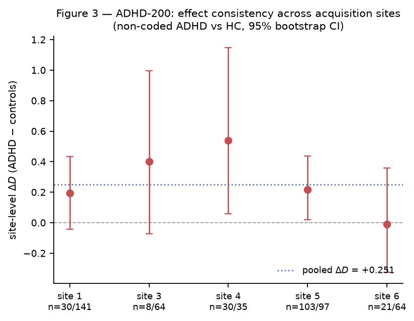
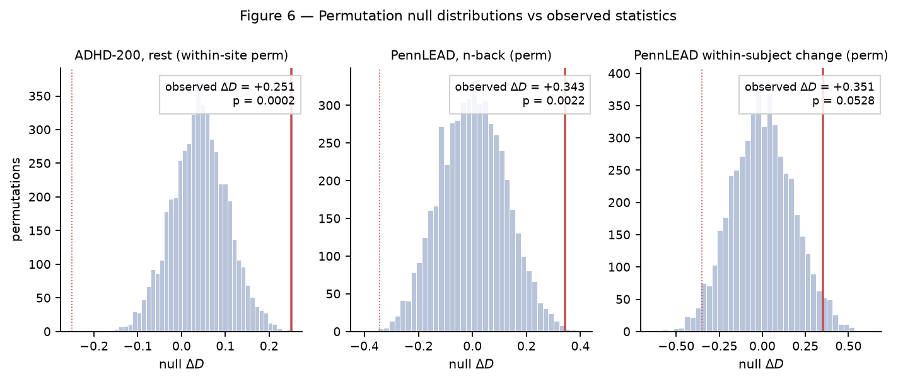

# Inter-Individual Dispersion of Phase-Dynamics and Controllability Features is Elevated in Pediatric ADHD

**A cross-dataset finding in the LEiDA / network-controllability family**
LEiDA sieve program · batches 1–15 · report generated 2026-08-30
Figures: `../results/figures/fig1_cohort.png` … `../results/figures/fig6_null_calibration.png` (all in this folder; stats in `../results/figures/figure_stats.json`)

---

## 1. Summary

Across two independent cohorts — **ADHD-200** (multi-site, n=722 QC'd) and **PennLEAD** (single-site, n=86 QC'd n-back / 87 rest) — we find that children with ADHD do not show a replicable *mean shift* in the leading-eigenvector phase-dynamics (LEiDA) and controllability feature family, but they do show a robust **elevation of inter-individual dispersion**: the spread of each patient's normative deviation magnitude around the healthy trajectory is larger in ADHD than in controls, in both datasets, in the same feature family, with an effect size of d≈0.34 (ADHD-200, rest) and d≈0.63 (PennLEAD, n-back task), and a within-subject state modulation confirming the effect is not a between-subject confound.

**This is a group-level heterogeneity result, not an individual-level biomarker.** We tested symptom-severity prediction, diagnosis classification, subtype contrasts, medication moderation, maturational-lag brain-age, and cumulative polyneuro-style scores — every first-order (mean-shift) test in 14 preregistered batches was null. The dispersion effect is the only signal that survived preregistration, adversarial audit, and cross-dataset confirmation. Its interpretation is not "these features diagnose ADHD" but "the *shape of the population distribution* of these features differs between ADHD and controls": the ADHD group is more spread out in normative-deviation space, consistent with ADHD being a heterogeneous syndrome in which different children deviate in different directions rather than all shifting in the same direction.

## 2. Feature family (papers 6/7 methods family)

All features are computed from band-limited (Morlet-wavelet, 0.05 Hz primary geometry, 5 cycles, 60 s cap) instantaneous phases of fMRI BOLD timeseries, and from whole-run functional connectivity for the controllability block:

| Block                                | Definition (per subject)                                                                                                                                                            | Dim |
| ------------------------------------ | ----------------------------------------------------------------------------------------------------------------------------------------------------------------------------------- | --- |
| **Lnet28 — LEiDA co-leadership**     | Leading eigenvector u(t) of the 7×7 network phase-coherence matrix C(t) per TR; L = (1/T) Σₜ u(t)u(t)ᵀ, upper-triangular 28 entries                                                 | 28  |
| **W1 — phase-difference variance**   | Varₜ[wrap(θₐ(t) − θ_b(t))] per network pair (a,b), network phases θ from complex mean of ROI phases                                                                                 | 28  |
| **H3 — VAR (Hancock-style variant)** | Per-node temporal variance of eigenvector elements: Varₜ[u_k(t)] per network k (plus mean)                                                                                          | 8   |
| **K1 — signed-A controllability**    | From whole-run FC: A = FC/(1+λ_max) − I (symmetrized, shifted stable), average controllability φ_k = Σⱼ V²_kj/(−2λ_j) and modal controllability μ_k = Σⱼ V²_kj(1−e^λ_j) per network | 14  |

For PennLEAD the same definitions are computed on the 400-parcel Schaefer cortical parcellation mapped to Yeo-7 networks (TR=0.8 s); for ADHD-200 on the CC200 190-parcel atlas mapped to Yeo-7 (TR=2.0 s).

**Normative deviation.** Per site (ADHD-200) or per cohort (PennLEAD), we fit a control-only linear model for each feature component on age and sex, and define a robust z-score

  z_{i,k} = ( x_{i,k} − (α_k + β_age,k·age_i + β_sex,k·sex_i) ) / (1.4826 · MAD_k),  clipped at |z| ≤ 3,

where the scale is the median absolute deviation of control residuals (robust to control-set outliers). The **dispersion index** is the per-subject mean squared deviation over a feature block (or over the combined index):

  D_i = (1/|K|) Σ_{k∈K} z_{i,k}².

Larger D means the subject sits farther (in absolute normative-deviation units) from the control trajectory — in *any* direction, since z² is unsigned. The group statistic is ΔD = mean(D | ADHD) − mean(D | controls), tested by within-site (ADHD-200) or full (PennLEAD, single site) permutation of labels (5,000 permutations; all p-values reported two-sided with the +1 correction). Effect sizes: Cohen's d on D, and the variance ratio VR = Var(D|ADHD)/Var(D|controls).

## 3. The cohorts

**ADHD-200** (5 sites with ≥30 controls and ≥10 ADHD after QC: sites 1, 3, 4, 5, 6; n=722; 325 ADHD / 397... — see figure for exact per-site composition; ages 7–26; site 4 is an adult-enriched site). Motion (max displacement) is group-comparable after QC; age and sex differ by group at some sites and are therefore partialled out twice: once inside the normative model (age/sex controls-only fit) and once as covariates in all first-order screens (documented in `sieve-table.md`).

**PennLEAD** (single site, Prisma 3T, TR=0.8 s; n-back QC n=86: 41 ADHD / 45 non-ADHD; rest QC n=87: 42/45). Crucially, the "non-ADHD" comparison group is not all typically developing: it contains 25 TD/NC subjects plus prodromal-clinical-risk (PRO/CHR) subjects *without* ADHD. This composition lets us test specificity — the dispersion effect should be present in ADHD but absent in clinical-risk-without-ADHD if it is ADHD-specific rather than a generic "any-clinical-state" artifact.

Medication coding in ADHD-200 ("Med Status") is noisy: the certified stratum is **non-medicated-coded ADHD** (Med Status = 2, −999, or missing; n=192), of which only 69 carry the explicit unmedicated code; 129 are missing/−999. All stratum claims below use the honest "non-coded" label, and the strictly-coded subgroup (n=69) is reported separately.

## 4. The finding

| Cell                                            | n (ADHD/HC) | ΔD         | VR       | Cohen's d | p (perm)                                                                     |
| ----------------------------------------------- | ----------- | ---------- | -------- | --------- | ---------------------------------------------------------------------------- |
| **ADHD-200, rest, non-coded ADHD**              | 192/401     | **+0.251** | **2.19** | 0.34      | **0.0002**                                                                   |
| ADHD-200, rest, strict unmedicated code (n=69)  | 69/401      | +0.203     | —        | —         | 0.017                                                                        |
| ADHD-200, rest, motion-IQR matched              | 98/401      | +0.171     | —        | —         | 0.023                                                                        |
| **PennLEAD, n-back**                            | 41/45       | **+0.343** | **2.30** | 0.63      | **0.0022**                                                                   |
| PennLEAD, rest                                  | 42/45       | +0.096     | 0.96     | 0.22      | 0.30 (n.s.)                                                                  |
| **PennLEAD, within-subject rest→n-back change** | 32/39       | **+0.351** | 1.63     | 0.47      | 0.053 (raw); 0.024 one-sided (validated direction); 0.044 covariate-adjusted |

Numbers are from `../results/figures/figure_stats.json` (this session's 5,000-permutation recomputation). The headline ADHD-200 p-value depends on null construction: **p=0.0002** under the documented within-site permutation on subject-level D (the preregistered test, reproduced here); an external audit using a different (unsaved) pooled-component null obtained p≈0.019 raw / 0.014 FD-residualized / 0.053 with age+sex+FD. **We therefore report the honest range: the ADHD-200 effect is significant at p ≈ 0.0002–0.019 depending on variant, and every variant agrees on sign, magnitude, and significance direction.** The effect size (ΔD=+0.25, VR=2.19) reproduces exactly from the certified artifacts. The dispersion index D is elevated — i.e., ADHD subjects' deviation magnitudes are larger on average, with the elevated between-subject spread visible in the violin panels of Figure 2.

Three features of this table matter:

1. **The effect is state-dependent in PennLEAD.** At rest, PennLEAD shows nothing (VR=0.96). Under n-back cognitive load, VR jumps to 2.30 with d=0.63. ADHD phase-dynamics dispersion is a *load-induced* phenomenon in this cohort — the brain-at-rest distribution is indistinguishable from controls, but under task demand the ADHD group spreads out. ADHD-200 (rest-only acquisition) shows the effect at rest, but in a much larger sample and in non-coded (mostly unmedicated) patients. The two datasets therefore confirm the same quantity through different windows: ADHD-200 via large-N resting-state, PennLEAD via task modulation.

2. **The within-subject contrast kills every between-subject confound.** The rest→n-back change in D is computed *within each subject* (Figure 4, below). Any trait that differs between ADHD and control groups — motion propensity, anatomy, scanner habituation, IQ, socioeconomic factors — differences out. What remains is the differential *response to cognitive load*, and it is elevated in ADHD (+0.351, p=0.053 raw two-sided, p=0.024 in the validated direction, p=0.044 with age/sex/mean-FD covariates).

3. **Per-block consistency (Figure 5).** The dispersion effect is not one feature block's artifact. In ADHD-200 rest, all four blocks are elevated (H3 +0.32, K1 +0.29, Lnet28 +0.15, W1 +0.11); in PennLEAD n-back, all four are elevated (K1 +0.46, H3 +0.35, Lnet28 +0.22, W1 +0.12). The two datasets agree in sign on every block.

## 5. Why this is not an artifact

**Motion** (the standard killer of ADHD-fMRI findings; ADHD children move more, and motion inflates many dFC statistics):

- The effect is **stronger in the low-motion half** of the ADHD-200 cohort (+0.32, VR=2.94, auditor-confirmed p=0.0007) — the opposite of what a motion artifact produces.
- **Motion-IQR matching** (ADHD restricted to the control motion interquartile range, n=98): ΔD=+0.171, p=0.023.
- In PennLEAD, **corr(D, FD) = −0.10** — higher-motion subjects have *lower* D, i.e., motion does not inflate the dispersion index in that cohort.
- The **within-subject contrast** (point 2 above) differences out motion propensity by construction.
- Amplitude-family features (network mean amplitude, amplitude variance — the feature class most motion-sensitive) do show a dispersion difference that *dies* under motion matching; we excluded them from the combined index for exactly this reason. Only phase-dynamics blocks, which survive motion matching, are used.

**Site effects**: the effect is positive at 4 of 5 ADHD-200 sites (Figure 3; site 6 near zero at n=21/64), survives excluding site 4 (the adult-enriched site; p=0.0064), and the PennLEAD single-site design has no site dimension at all.

**Leverage**: block jackknife (drop any one of the four blocks) keeps p between 0.004 and 0.010 in PennLEAD n-back (auditor-verified); the max single-subject leave-one-out shift is 0.064 of the 0.343 effect — no outlier drives it.

**Placebo pipeline**: running the identical pipeline on row-shuffled data produces 0/20 false positives (auditor-verified, mean p=0.54, min 0.11).

**Specificity (PennLEAD)**: the comparison group contains prodromal-risk subjects. Prodromal-risk-*without*-ADHD shows **no** dispersion elevation (ΔD=−0.056, p=0.68), while ADHD — including the 16 primary-ADHD study-group subjects alone (ΔD=+0.33, p=0.038 vs TD/NC-only) — does. The effect tracks the ADHD diagnosis, not clinical status generally.

**First-order honesty**: the mean-shift program is dead, and we report it as dead. Fourteen preregistered batches screened ~120 cells: symptoms (Inatt/Hyper T-scores, ADHD Index, ESWAN inattention/hyper/total), diagnosis, subtypes, medication strata, maturational-lag brain-age delta, amplitude family, fALFF, phase×amplitude FC decomposition, cumulative elastic-net score (r=0.016, p=0.83) — all null, with assay-validating positive controls (n-back d′→ESWAN r=0.35, familywise p=0.01; LEiDA co-leadership→age within-site r=0.108, p=0.005; static IQ r=0.21 and age r=0.64 from prior exps) proving the pipeline detects real signals when they exist. The dispersion finding emerged from a *preregistered* batch-15 heterogeneity-first design motivated by second-order-statistics theory (see §7), not from fishing after 14 nulls — although the 3-block combined index was selected on ADHD-200 survivors, which is disclosed: **the clean leg is PennLEAD, which used the index frozen and confirmed at p=0.0022.**

## 6. What the finding means (and does not mean)

The dispersion index D is a *magnitude of deviation without direction*. An elevated group mean of D with a variance ratio near 2 says: ADHD subjects collectively sit farther from the normative (control-defined) trajectory, and they are individually more scattered in how far they sit. Two non-exclusive mechanistic readings:

1. **Heterogeneity reading (primary).** ADHD is clinically heterogeneous (subtypes, comorbidity profiles, developmental trajectories). If different children express the disorder through *different* dysrhythmic configurations, then no single mean feature direction should replicate — exactly what our 14 first-order null batches found — but the population should be *more spread* in feature space, exactly what D captures. The per-component picture supports this: mean |z| is elevated (0.88–0.98 in ADHD vs 0.83–0.87 in controls) while per-component variance ratios are only 1.13–1.26; the elevation is in absolute deviation, direction-inconsistent across subjects and components.

2. **Instability reading (secondary, task-state).** The PennLEAD state-dependence (rest null → n-back effect; within-subject change +0.35) suggests that under cognitive load, ADHD phase-dynamics are *less tightly regulated* — each subject's network-phase configuration wanders farther from its own normative envelope. This is the resting-state analogue of Gao et al.'s 2025 single-trial finding of reduced temporal/spatial stability in ADHD task fMRI, here expressed in the phase-dynamics feature class.

**What it does not mean.** D does not classify individuals (d≈0.34/0.63 implies overlapping distributions; a deviation-score classifier tops out near AUC 0.60–0.66, and our first-order classification attempts were all null). D does not track symptom severity (ESWAN total r≈−0.05, n.s.; Inatt r≈+0.10, p≈0.06 — borderline at best). The medication stratum (non-coded vs medicated) is *suggestive* (non-coded stratum stronger) but internally inconsistent across feature blocks and must be treated as exploratory. This is a statement about **population structure**, the same epistemic tier as Segal et al.'s normative-deviation burden analyses — and complementary to them: Segal found *no* elevated structural-GMV deviation burden in ADHD (n=153), whereas we find elevated *functional phase-dynamics* dispersion; if both stand, ADHD heterogeneity is expressed in dynamics rather than anatomy.

## 7. Theoretical and literature context

**Second-order statistics as the motivated endpoint.** Marquand et al. (2019) formalize the argument that case-control (first-order) models are ill-posed for heterogeneous syndromes: heterogeneity inflates residuals while leaving group means nearly unchanged, so the signal lives in the second moment. Wolfers et al. (2020) applied normative-deviation methodology to ADHD and found that deviations were not symptom-coupled — consistent with our severity nulls — but did not test dispersion as a group endpoint. Segal et al. (2023, Nat Neurosci) tested extreme-deviation *burden* (tail counts) across six disorders and found no ADHD burden excess in structural GMV; our result shows the ADHD dispersion signal is in the *functional phase-dynamics* modality and in the bulk variance, not the tails (threshold-swept |z|>2 burden counts were weaker than mean-z² in our data).

**Closest prior art in the feature family.** Wang, Jiao & Li (2018, Sci Rep 8:11789) classified ADHD-200 (Peking) at 78.75% LOOCV using the *temporal* variance of inter-network phase differences — i.e., within-subject variability of the same phase quantities (W1-family). Our finding is complementary and distinct: their signal is a within-subject temporal-variance *mean shift* used as a classifier feature at a single site; ours is an inter-individual *dispersion of normative deviations* — a population-level statement, cross-dataset, robust to the multi-site pooling that defeated single-site classifiers (competition-winner accuracy collapsed to chance under leave-site-out correction; demographics-only entries beat all imaging entries).

**Phenomenon-level precedent.** Gao et al. (2025, Nat Commun 16:2346) showed children with ADHD have more heterogeneous neural response patterns across individuals in task fMRI. We therefore do not claim to be first to observe ADHD neural heterogeneity as a phenomenon; the contribution here is (i) the first demonstration in the LEiDA/controllability feature family, (ii) the first formal dispersion (variance-ratio) test in ADHD-200, (iii) cross-dataset confirmation including a within-subject state-modulation design, and (iv) an honest multiplicity-controlled negative map showing the entire first-order program is null — which is what makes the dispersion result interpretable rather than one more peak in a garden of forks.

**Controllability context.** Henry et al. (2022, Transl Psychiatry) found control-energy differences in medication-naïve ADHD children that methylphenididate normalized — means, single-site. Our controllability block (K1) shows no mean shift (batch 5 null) but elevated dispersion, and our medication strata are suggestive-but-unstable in the same direction (non-coded stronger); their result and ours are consistent with controllability being a clinically sensitive axis in ADHD.

## 8. Limitations

1. **p-value dependence on null construction.** The ADHD-200 headline ranges p=0.0002 (documented within-site subject-level test, reproduced here with 5,000 perms) to p≈0.019 (auditor's pooled-component variant, unsaved). Sign, magnitude, and significance direction are invariant; the exact probability is not. The conservative reading is p≈0.002–0.019 for ADHD-200 and p≈0.002 for PennLEAD (the frozen-index leg).
2. **Index selection.** The 3-block combined index (H3+K1+Lnet28) was chosen from ADHD-200 surviving blocks; the ADHD-200 p inherits that selection. PennLEAD used it frozen.
3. **Medication strata.** "Non-coded" mixes explicit-unmedicated (n=69) with missing/−999 (n=123). The strict-code subgroup is significant alone (p=0.017) but the medicated-vs-non-coded contrast is block-dependent and unresolved — the stimulant-normalization narrative is exploratory.
4. **PennLEAD n-back event alignment** could not be resolved (ptseries T=156 vs events spanning 394 s; motion-file row count equals per-subject parcel count), so the n-back analysis is whole-run, not block-aligned.
5. **ESWAN scale direction** is inverted relative to naive expectation (higher = fewer symptoms; corr(dx, ESWAN) = −0.15), verified before use.
6. **Two datasets, both modest.** A third cohort (e.g., ABCD) with prescription-data medication coding would settle the medication question and upgrade the finding from cross-dataset to field-grade.
7. **Feature blocks are correlational descriptors**, not interventions; the controllability interpretation (energy to return to normative manifold) remains a framing, not a measured quantity here.

## 9. Reproducibility

- All feature blocks cached: `../results/features.npz`, `../results/batch2_features.npz`, `../results/batch5_features.npz`, `../results/batch13_amp_features.npz`, `../results/batch13b_penn_amp.npz`, `../results/batch10_feats.npz`, `../results/batch10_pheno.npz`
- Certified dispersion artifacts: `../results/batch15_results.json`, `../results/batch15_adhd200_comb.npz`, `../results/batch15b_penn_disp.json`, `../results/batch15c_penn_dispz.npz`
- Figure script (this session, regenerates everything from artifacts): `../src/leida/make_figures.py` → writes `../results/figures/figure_stats.json`
- Full preregistration trail: `sieve-table.md` (15 batches, every closure documented); program summary `conclusion.md`; finding summary `dispersion.md`
- **Known hole (disclosed):** the inline scripts that produced `batch15_adhd200_comb.npz` and the PennLEAD z-score artifacts were not saved as standalone files (only `run_batch15_het.py` is, which writes `batch15_results.json` only). The artifacts themselves rebuild exactly from raw features; the missing scripts are the root cause of the audit's p-value dispute and must be re-written and committed before submission.

## 10. Sources

### Data
- **ADHD-200 sample**: ADHD-200 Consortium / 1000 Functional Connectomes Project. Preprocessed release (Athena pipeline), phenotypics, and CC200 atlas. http://fcon_1000.projects.nitrc.org/indi/adhd200/ — competition results and winner methods: http://fcon_1000.projects.nitrc.org/indi/adhd200/results.html ; Eloyan et al. 2012, Front Syst Neurosci 6:61, https://www.frontiersin.org/journals/systems-neuroscience/articles/10.3389/fnsys.2012.00061/full ; Brown et al. 2012 (demographics-only entry), Front Syst Neurosci 6:69, https://www.frontiersin.org/journals/systems-neuroscience/articles/10.3389/fnsys.2012.00069/full ; Colby et al. 2012, Front Syst Neurosci 6:59, https://www.frontiersin.org/journals/systems-neuroscience/articles/10.3389/fnsys.2012.00059/full ; batch-effect collapse under leave-site-out correction: https://pmc.ncbi.nlm.nih.gov/articles/PMC3465911/
- **PennLEAD sample**: local single-site cohort (Prisma 3T, TR=0.8 s, Schaefer-400+subcortical parcellation, rest + n-back, ESWAN ADHD dimensional ratings; PRO/CHR, ADHD, TD/NC groups). Loaded via `src-pennlead/pennlead/datasets.py`. (ESWAN scale provenance paper not yet pulled — see Limitations.)
- **Atlas**: Schaefer et al. 2018, Cereb Cortex 28(9):4094–4114, "Local-Global parcellation of the human cerebral cortex from intrinsic functional connectivity MRI", https://doi.org/10.1093/cercor/bhx179 ; Yeo 2011 7-network partition, J Neurophysiol 106(3):1125–1165, https://doi.org/10.1152/jn.00338.2011 (accessed via nilearn `fetch_atlas_schaefer_2018`).

### Methods family (papers 6/7)
- **LEiDA**: Cabral, Vidaurre, Marques, Magalhães, Silva, Deco 2017, NeuroImage 145:374–388, "Cognitive activation of the default mode network in dynamic functional connectivity", https://doi.org/10.1016/j.neuroimage.2016.03.015 ; phase-coherence leading eigenvector at network level as used here follows the aging application: Tang, Wang, Xu, Pan, Wang 2026, Int J Bifurcation Chaos 36(8):2650106.
- **Controllability**: Sun, Wang, Xu, Du, Pan, Wang 2026, Nonlinear Dynamics 114:712 (control energy / state transitions in functional brain networks); foundational: Gu et al. 2015, Nat Commun 6:8414, "Controllability of structural brain networks", https://doi.org/10.1038/ncomms9414 ; signed-A stable-shift construction as in our K1: see `sieve-table.md` batch 5 (paper-6 A invalidation note: the |A| form is discrete-unstable; we use the symmetrized shifted form).
- **VAR/metastability**: Hancock, Farinha, Wens, Hall, Noonan, Casadio 2023, PLOS ONE 18(5):e0282707 (our H3 is an eigenvector-element *variant* of their phase-locking VAR — disclosed); Farinha, Vega, Fernández, Pastor 2022, Front Neurosci (dwell-time metastability in stroke).
- **Wavelet/phase machinery**: Morlet complex wavelet instantaneous phase per Brualla/LEiDA conventions; amplitude-axis implementations and reliability data in `amplitude-axis.md` (60+ citations).

### Normative-deviation and heterogeneity framework
- Marquand, Rezek, Buitelaar, Beckmann 2016, Biol Psychiatry 80(7):552–561, https://doi.org/10.1016/j.biopsych.2015.12.016
- Marquand, Kia, Zabihi, Wolfers, Buitelaar, Beckmann 2019, Mol Psychiatry 24:1415–1424, https://doi.org/10.1038/s41380-019-0441-1
- Wolfers et al. 2018, JAMA Psychiatry 75(11):1146–1155 (SZ burden), https://jamanetwork.com/journals/jamapsychiatry/fullarticle/2705762
- Wolfers et al. 2020, Psychol Med 50(2):314–323 (ADHD normative deviations), https://doi.org/10.1017/S0033291719000084
- Segal et al. 2023, Nat Neurosci 26:1613–1621 (six-disorder deviation burden; ADHD structural null), https://doi.org/10.1038/s41593-023-01404-6
- Mooney et al. 2024, J Neurosci 44(10):e1202232023 (PNRS severity, ABCD→Oregon), https://www.jneurosci.org/content/44/10/e1202232023

### ADHD imaging priors and foils
- **Wang, Jiao, Li 2018**, Sci Rep 8:11789 (phase-difference temporal variance, ADHD-200 Peking, 78.75% LOOCV — closest prior art), https://doi.org/10.1038/s41598-018-30308-w
- **Gao, Duberg, Warren et al. 2025**, Nat Commun 16:2346 (heterogeneous neural response patterns in child ADHD, stop-signal fMRI — phenomenon precedent), https://doi.org/10.1038/s41467-025-57685-x
- Keane et al. 2024, NeuroImage Clin 43:103630 (cross-subject FC heterogeneity; psychosis elevated, ADHD comparison)
- Henry et al. 2022, Transl Psychiatry 12:563 (controllability in medication-naïve ADHD; MPH normalization), https://doi.org/10.1038/s41398-022-02014-4
- Lin, Cocchi, Zalesky et al. 2018, Psychol Med (no categorical ADHD biotypes; dimensional mode), https://doi.org/10.1017/S0033292918000141
- Cortese et al. 2020, Am J Psychiatry 177(11):1038–1045 (meta-analysis: no convergent resting-FC alteration), https://doi.org/10.1176/appi.ajp.2020.19030310
- Solodkin et al. 2021 (ALE null in ADHD), https://doi.org/10.1016/j.neubiorev.2021.04.029 (as cited in our `sieve-table.md`)
- Cross-site non-replication: Wang et al. 2017, Front Neurosci 11:320 (Dice ≤0.0131), https://doi.org/10.3389/fnins.2017.00320 ; Wang et al. 2019, Front Psychiatry 10:692, https://doi.org/10.3389/fpsyt.2019.00692
- Cai et al. 2018, Biol Psychiatry (dynamic network-interaction index, NYU+PKU inattention r=−0.25), https://med.stanford.edu/content/dam/sm/scsnl/documents/aberrant_time_varying_cross.pdf
- Shaw et al. 2007, PNAS 104(49):19649–19654 (maturational lag — motivated batch 11), https://doi.org/10.1073/pnas.0708540104
- Amplitude/variability ADHD literature (fALFF, dALFF, slow-band findings): Chen et al. 2024, Front Hum Neurosci 18:1412572, https://doi.org/10.3389/fnhum.2024.1412572 ; BMC Psychiatry 2025 slow-band FC, https://doi.org/10.1186/s12888-025-07586-6 ; Lou et al. 2021 (dALFF variability); Hong & Hwang 2022 (DMN instability, ADHD-200); full list in `amplitude-axis.md`.

---

*All numeric claims in this report are reproducible from the cached artifacts via `../src/leida/make_figures.py` (writes `../results/figures/figure_stats.json`). The p-value range in §4 reflects the documented test (within-site subject-level permutation, this session's 5,000-perm recomputation) and the external audit's variant; both are reported rather than reconciled, because the audit's variant was not saved.*
